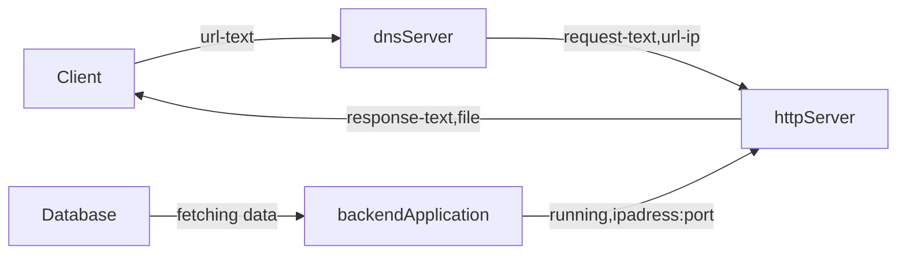
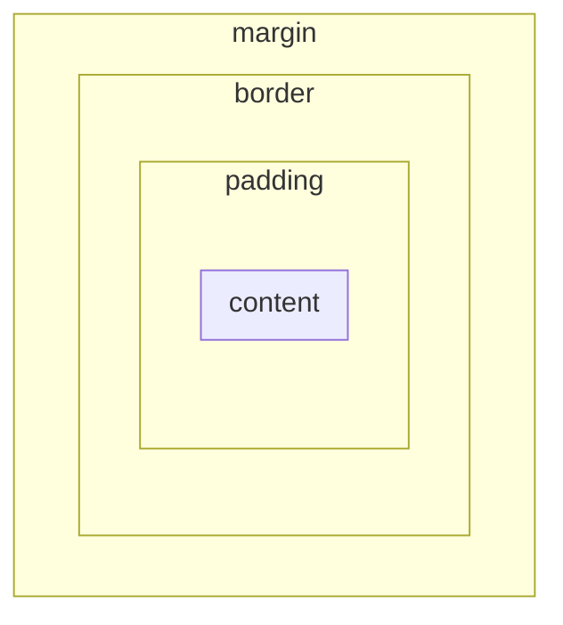

# How web works
***

### Client
- Any device or machine that can be used to send request
- For sending request a protocol or rule is to be followed which comes under http/https
- The request contains plain text if it is http and encrypted text if it follows https

### Server
- Any device or machine that can be used to accept the request and send responses as needed
- Request is accepted through a port, which states that this particular port is responsible to take data in form of text by using http or https protocol
- Response is sent via same port, which states that after accepting the request what to send from the server
- Particular methods are used to ask the server to accept the request and response them: GET, POST, PUT are some of them
- A Server can send data same as we read write the hard disk, but it will be sending data through some protocol in this case it is http/https

# Components
***

- ## Frontend
	- ### interaction
	- ### Fetching required data
	- ### Responsive
	
- ## Backend
	- ### Processing data
	- ### Manipulation of data
	- ### Management of data
	
- ## Database
	- ### Storing data
	- ### Efficient Read and Write operation in data

# Frontend (Web-dev)
***

## Tools
- ### HTML
- ### CSS
- ### JS

## HTML
***
- #### Hyper Text Markup Language
	- Hyper Text - text with sources that can be accessed through web
	- Markup - identifiers which helps to structure the document
	- Language - a combination of the above 2 such that, machine can understand it.
- #### HTML is responsible to structure the whole webpage using elements
	- Structuring covers the blueprint or main elements that are bare bone and needed in the page.
	- These elements are by default stacked after one another.
	- HTML elements are like different types of building blocks that we use to put together a webpage
	- Each element has a special job defined by the markup tag.
	- HTML parser is responsible to understand which tag is there and what it do for structuring the web page.
- #### HTML is rendered on the web in the form of tree
	- HTML parser parses the whole document in the form of tree data structure.
	- This HTML tree signifies the parent child relationship from the nested tags that are used in the document.
	- The tree data structure is chosen because it highly resembles with the type of code an html document is having i.e. nested elements.
	- Search operation for any particular element is also efficient if developer wants to hand pick and change them from the document.
- #### HTML tags
	1. `<!DOCTYPE html>`: Specifies the HTML version being used (HTML5 in this case).
	2. `<html>`: The root element that wraps all other HTML content.
	3. `<head>`: Contains meta-information about the document, like the title and links to external resources.
	4. `<title>`: Sets the title of the web page that appears in the browser's title bar or tab.
	5. `<meta>`: Provides metadata about the document, like character encoding and viewport settings.
	6. `<link>`: Links external resources like stylesheets, favicons, and more.
	7. `<script>`: Embeds JavaScript code or links to an external JavaScript file.
	8. `<style>`: Contains CSS code for styling the HTML content.
	9. `<body>`: Contains the visible content of the web page.
	10. `<h1>`, `<h2>`, `<h3>`, `<h4>`, `<h5>`, `<h6>`: Heading elements for creating different levels of headings.
	11. `
`: Defines a paragraph of text.
	12. `<a>`: Creates hyperlinks to other web pages or resources.
	13. ``: Embeds images on the web page.
	14. `<ul>`, `<ol>`, `<li>`: Used to create unordered (bulleted) and ordered (numbered) lists.
	15. `<table>`, `<tr>`, `<th>`, `<td>`: Tags for creating tables, rows, table headers, and table data cells.
	16. `
`: A generic container for grouping and styling other HTML elements.
	17. ``: A small, inline container for applying styles to a specific part of text.
	18. `<form>`, `<input>`, `<button>`: Used for creating interactive forms and form elements.
	19. `<textarea>`: Creates a multi-line text input field.
	20. `<label>`: Associates a label with a form element for better user experience.
	21. `<select>`, `<option>`: Creates dropdown menus and options within them.
	22. `<iframe>`: Embeds external content within the web page, like maps or videos.
	23. `<audio>`, `<video>`: Embeds audio and video content.
	24. `<header>`, `<nav>`, `<main>`, `<article>`, `<section>`, `<aside>`, `<footer>`: Semantic tags for structuring content and improving accessibility.
	25. `
`: Creates a horizontal rule, often used to separate content sections.
	26. ` `: Inserts a line break within text content.
	27. `<strong>`, `<em>`: Used for emphasizing or highlighting text, with `<strong>` representing strong emphasis.
	28. `<abbr>`, `<cite>`, `<q>`: Tags for defining abbreviations, citations, and inline quotations.
	29. `<mark>`, `<del>`, `<ins>`: Tags for highlighting text, showing deleted text, and showing inserted text.
	30. `<time>`, `<progress>`, `<meter>`: Tags for displaying time, progress bars, and meter readings.

## CSS
***
- #### Cascading Style Sheet
	- It's a language used to describe the presentation and visual styling of  elements written in HTML or other markup languages.
	- Cascading - basically means that multiple styles can be applied on a single html document
	- Style Sheet - this represent the set of rules that are used to implement styles on the element
- #### CSS cascade
	- This refers to create a specific order of precedence for determining which styles should be applied to an element.
	- It depends on 3 major terms
		- Specificity - Specificity determines which style rule is more relevant to an element. It is based on the selector's complexity and the number of selectors used to target an element. (using the array of 3 0's and 1's)
		- Source Order - When conflicting styles have equal specificity, the style defined later in the source code takes precedence. (proceeds line by line)
		- Importance - Importance allows developers to explicitly declare that certain styles should take precedence over others. (using `!important` keyword)
- #### Types of CSS
	- The precedency is higher from Inline to Internal to External
	- External CSS - Styles are defined in separate `.css` files and linked to HTML documents using the `<link>` element.
	- Internal CSS - Styles are defined within the `<style>` tag in the HTML document's `<head>` section.
	- Inline CSS - Styles are applied directly to individual HTML elements using the `style` attribute.
- #### CSS Box Model

	- The Box Model is visualized as a series of nested boxes, with each box representing an HTML element property. 
	- There are four main components to the Box Model - Content, Padding, Border, Margin respectively
	- Content - This is the actual content of the HTML element, such as text, images, or other nested elements.
	- Padding - Padding is the space between the content area and the element's border. It's often used to create space around the content and improve visual aesthetics.
	- Border - he border surrounds the padding and content areas. It can have its own properties like color, style, and width, allowing you to create visible dividers between elements.
	- Margin - The margin is the space between the element's border and neighboring elements. Margins are used to create spacing between elements, controlling their positioning and preventing them from being too close to one another.

- #### CSS Properties

	1. **Display (`display`):** Determines how an element is displayed on the page, such as block, inline, inline-block, flex, etc.
	2. **Width (`width`) and Height (`height`):** Control the dimensions of an element.
	3. **Margin (`margin`):** Sets the space outside the border of an element, creating spacing between elements.
	4. **Padding (`padding`):** Sets the space between the content and the border of an element.
	5. **Border (`border`):** Sets the width, style, and color of an element's border.
	6. **Background (`background`):** Defines the background color and image properties of an element.
	7. **Color (`color`):** Sets the text color of an element's content.
	8. **Font (`font`):** Controls the styling of text, including font size, family, weight, and style.
	9. **Text (`text`):** Defines various text properties such as alignment, decoration, and spacing.
	10. **Position (`position`):** Determines how an element is positioned on the page, using values like relative, absolute, fixed, and static.
	11. **Float (`float`):** Controls the positioning of elements within a container, often used for creating column layouts.
	12. **Flexbox (`display: flex`):** A layout model that allows for efficient alignment and distribution of elements in a container.
	13. **Grid (`display: grid`):** A layout model that arranges elements in rows and columns, offering powerful control over their placement.
	14. **Overflow (`overflow`):** Determines how content that overflows an element's dimensions should be displayed (hidden, scroll, auto).
	15. **Visibility (`visibility`):** Controls whether an element is visible or hidden without affecting the layout.
	16. **Box-sizing (`box-sizing`):** Specifies how an element's width and height should be calculated, including or excluding padding and borders.
	17. **Opacity (`opacity`):** Sets the transparency of an element, allowing content to be partially see-through.
	18. **Transition (`transition`):** Creates smooth transitions between CSS property values, often used for animations.
	19. **Transform (`transform`):** Applies transformations like rotation, scaling, and translation to elements, often used for animations and layout adjustments.
	20. **Box-shadow (`box-shadow`):** Adds a shadow effect around an element's border box.
	21. **Text-shadow (`text-shadow`):** Adds a shadow effect to text characters.
	22. **Border-radius (`border-radius`):** Rounds the corners of an element's border box.
	23. **Z-index (`z-index`):** Controls the stacking order of elements, determining which elements appear in front of others.
	24. **Cursor (`cursor`):** Specifies the mouse cursor to be displayed when hovering over an element.
	25. **Flex (`flex`):** Individual properties like `flex-grow`, `flex-shrink`, and `flex-basis` are used in flex layouts to control the behavior of flex items.
